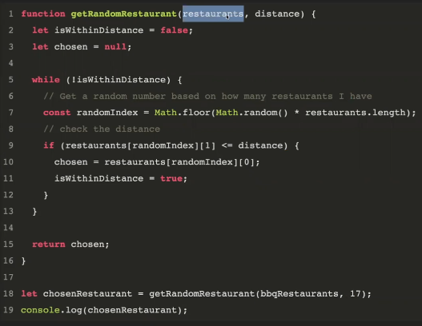
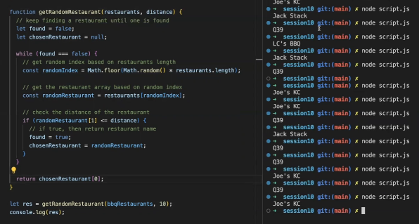

# Front End Web Development Fundamentals

## Udacity's Nanodegree. Cohort 4

### Arrays and Objects Practice

#### Assignments

- **ARRAYS**

1. Random Restaurant Generator

    1.1. Create a new array containing 5 different restaurant names.

    1.2. Write a function called `getRandomRestaurant` that takes in an array of restaurants and returns a random restaurant from the array.

    Hints:

    - To calculate a random number in JS we can use:
        - Math.floor(Math.random()*howManyNums)
            - Math.floor(num) rounds a number down to the nearest integer.
            - Math.random() returns a random number between 0 (inclusive) and 1 (exclusive).

2. Random Restaurant Generator - Advanced

    2.1. Given a list of restaurants and their distance from home, write a function called `getRandomREstaurantDistance` that takes in an array of restaurants and distance.

    2.2. Return a random restaurant from the array that is within the distance specified.

    - [x] _**Instructor's solutions**_

    

    

- **OBJECTS**

1. Profile Lookup

    1.1. Create a `userProfile` object that contains your `firstName`, `lastName` and `numberOfSiblings`.

    1.1. Create a function `getNumSiblings` that takes in a profile object and returns the value of `numberOfSiblings`.

2. Profile Lookup - Advanced

    2.1. Create an array called `players` that contains a list of pplayers profile objects containing a player's `name`, `number`, and `position`.

    2.2. Create a function `getPosition` that takes in the parameters `names` and `numbers`, finds the correct `player` based on the parameters, and returns the position.

#### Solutions

[Document](./arraysobjectsPractice.js)
